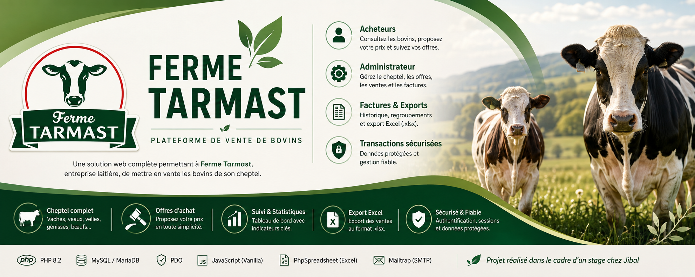

<p align="center">
  
</p>

# 🐄 Ferme Tarmast — Plateforme de vente de bovins

Plateforme web permettant à **Ferme Tarmast**, entreprise laitière, de mettre en vente les bovins de son cheptel. Les acheteurs consultent les annonces et proposent un prix ; l'administrateur accepte ou refuse chaque offre.

Projet réalisé dans le cadre d'un stage chez **Jibal**.

---

## ✨ Fonctionnalités

### 👤 Espace acheteur
- Inscription avec validation par email
- Connexion sécurisée (hachage des mots de passe, gestion de session PHP)
- Consultation des bovins disponibles (vaches, veaux, velles, génisses, bœufs)
- Détail d'un animal (âge, poids, description, photo)
- Proposition d'un prix d'achat pour un bovin
- Suivi de ses offres (en attente / acceptée / refusée)
- Gestion du profil utilisateur

### ⚙️ Espace administrateur
- Tableau de bord avec indicateurs clés (revenu total, nombre de ventes, panier moyen, cheptel)
- Gestion du cheptel : ajout, modification et suppression d'un bovin (avec upload de photos)
- Gestion des offres reçues (acceptation ou refus avec traitement automatique des offres concurrentes sur le même animal)
- **Historique des ventes et filtres multicritères** :
  - Filtrage par période (Date début / Date fin)
  - Filtrage par acheteur
- **Exportation Excel (.xlsx)** :
  - Génération d'un fichier Excel stylisé, compact et centré
  - Colonnes personnalisées : *Numéro de série, Date, Nom & Prénom, Adresse mail, Téléphone, Produit, Quantité, Montant HT, Montant TTC (TVA 20%)*
- **Système de facturation complet & Impression PDF** :
  - Auto-génération des factures à l'acceptation des offres avec numérotation strictement séquentielle (`FACT-2026-0001`, `FACT-2026-0002`...)
  - **Historique des factures (`admin/factures.php`)** : recherche et archivage permanent de toutes les factures émises
  - **Facture imprimable/téléchargeable en PDF (`admin/voir_facture.php`)** :
    - Logo officiel `iconVache.png`
    - Détails émetteur et client acheteur
    - Tableau de facturation (*DÉSIGNATION, QUANTITÉ, PRIX HT, TVA, MONTANT HT, MONTANT TTC*)
    - **Montant total en toutes lettres** (ex: *« Deux mille quatre cents Dirhams »*)
    - Styles d'impression épurés (masquage de l'URL/périphérie du navigateur via `@page`)

---

## 🛠️ Stack technique

| Domaine | Technologie |
|---|---|
| Backend | PHP 8.2 (PDO, requêtes préparées) |
| Base de données | MySQL / MariaDB |
| Frontend | HTML5, CSS3, JavaScript (Vanilla) |
| Exports | [PhpSpreadsheet](https://github.com/PHPOffice/PhpSpreadsheet) (`phpoffice/phpspreadsheet`) |
| Emails | [Mailtrap](https://mailtrap.io) (API / SMTP) |
| Gestionnaire de paquets | Composer |

---

## 📁 Structure du projet

```
├── actions/                  # Traitements (login, register, offres, vaches...)
├── admin/                    # Espace administrateur
│   ├── dashboard.php         # Tableau de bord principal
│   ├── liste_vaches.php      # Gestion du cheptel
│   ├── ajouter_vache.php     # Formulaire d'ajout
│   ├── modifier_vache.php    # Formulaire de modification
│   ├── offres.php            # Gestion des offres d'achat
│   ├── ventes.php            # Historique des ventes & filtres
│   ├── factures.php          # Historique et gestion des factures
│   ├── voir_facture.php      # Facture imprimable / export PDF avec logo & total en lettres
│   └── export_ventes_excel.php # Export des ventes sous format Excel (.xlsx)
├── client/                   # Espace acheteur (accueil, détails, offres, profil)
├── includes/                 # Fonctions partagées, sessions, helpers (nombreEnLettres, factures...)
├── config/                   # Connexion base de données, config SMTP, schéma SQL
├── assets/                   # Images statiques et icônes (iconVache.png, banner-github.png...)
├── uploads/                  # Photos des bovins uploadées
├── docs/                     # Diagramme de cas d'utilisation, MCD
├── index.php                 # Page d'accueil publique
├── login.php / register.php  # Authentification
└── composer.json             # Dépendances du projet
```

---

## 🚀 Installation

### Prérequis
- PHP ≥ 8.0 (avec extensions `gd`, `zip`, `mbstring`, `pdo_mysql`)
- MySQL / MariaDB
- Composer
- Un compte [Mailtrap](https://mailtrap.io) (pour l'envoi des emails de confirmation)

### Étapes

1. **Cloner le dépôt**
   ```bash
   git clone https://github.com/Ilyas-SEKHSOUKHI/Cattle-Sales-Platform.git
   cd Cattle-Sales-Platform
   ```

2. **Installer les dépendances PHP**
   ```bash
   composer install
   ```

3. **Créer et initialiser la base de données**

   Importer le schéma fourni :
   ```bash
   mysql -u root -p < config/db.sql
   ```

   Cela crée la base `tarmast_db`, les tables `utilisateurs`, `vaches`, `offres`, `factures`, ainsi qu'un compte administrateur par défaut.

4. **Configurer la connexion à la base de données**

   Vérifier et adapter `config/database.php` si nécessaire (hôte, utilisateur, mot de passe).

5. **Configurer l'envoi d'emails**

   Renseigner vos identifiants Mailtrap dans `config/smtp.php` :
   ```php
   $smtpConfig = [
       'enabled'  => true,
       'host'     => 'live.smtp.mailtrap.io',
       'port'     => 587,
       'username' => 'api',
       'password' => 'VOTRE_CLE_API_MAILTRAP',
       'encryption'  => 'tls',
       'from_email'  => 'no-reply@tarmast.ma',
       'from_name'   => 'Ferme Tarmast',
   ];
   ```

6. **Lancer l'application**
   ```bash
   php -S localhost:8000
   ```

   Ouvrir votre navigateur sur [http://localhost:8000](http://localhost:8000).

---

## 🔑 Compte administrateur par défaut

| Email | Mot de passe |
|---|---|
| `admin@tarmast.ma` | `admin123` |

> ⚠️ À modifier immédiatement après la première connexion.

---

## 🗄️ Modèle de données

- **utilisateurs** — Comptes acheteurs et administrateurs (rôles, statut de vérification par email).
- **vaches** — Bovins mis en vente (nom, type de bovin, âge/date de naissance, poids, description, photo, statut *disponible/vendue*).
- **offres** — Propositions d'achat soumises par les acheteurs (montant, date, statut *en_attente/acceptee/refusee*).
- **factures** — Factures archivées et numérotées séquentiellement (numéro, offre, acheteur, bovin, montants HT/TTC, date, statut).

---

## 📄 Licence

Projet réalisé dans un cadre pédagogique / stage chez **Jibal**.